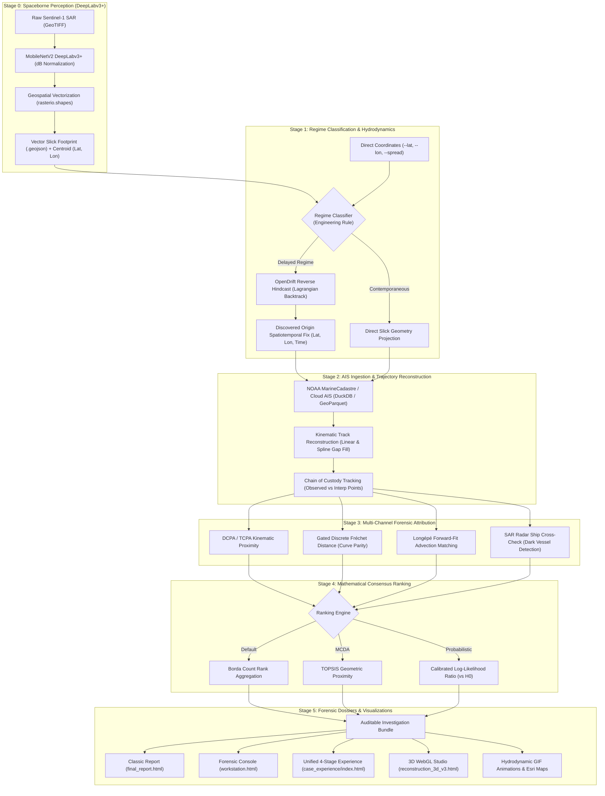
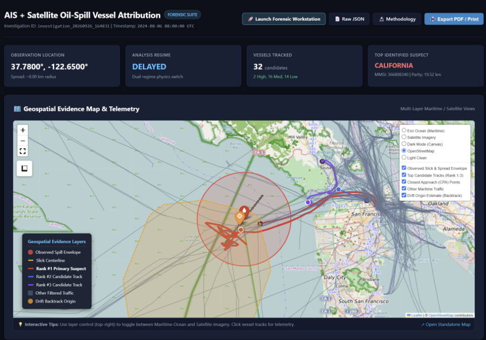
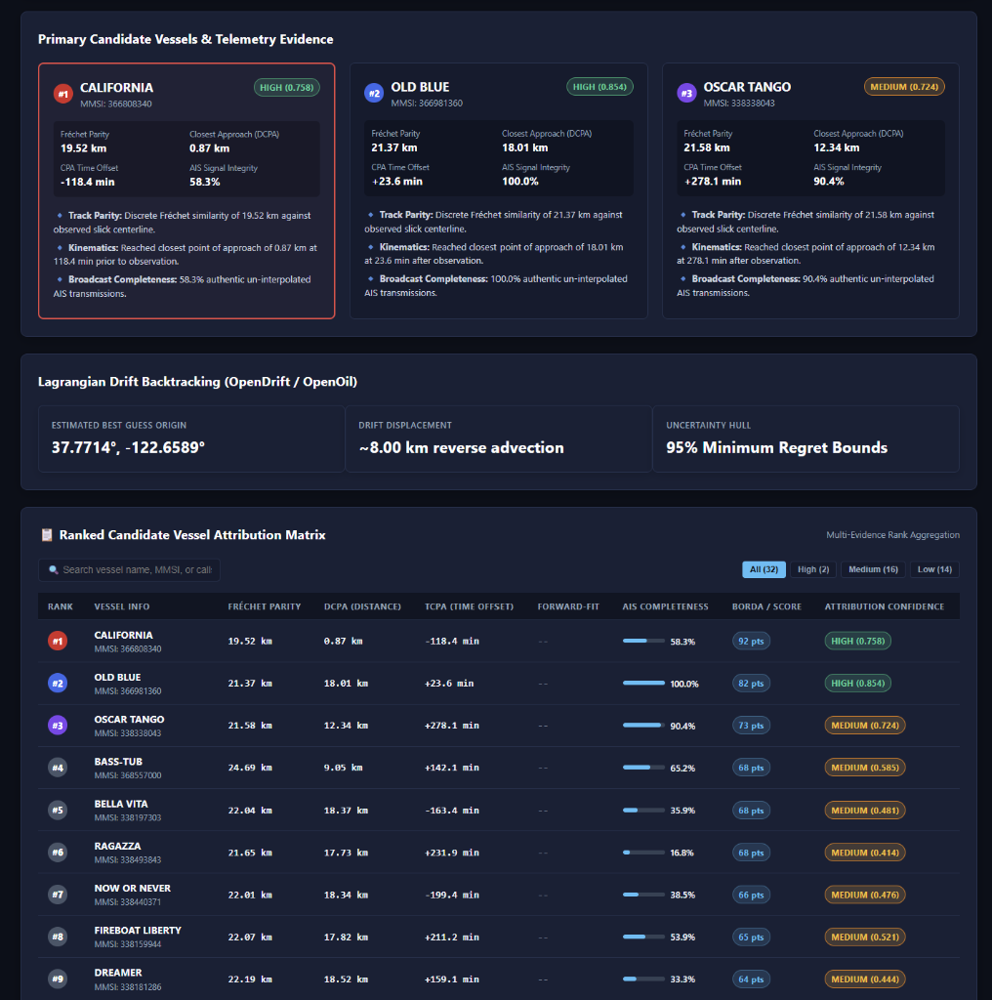
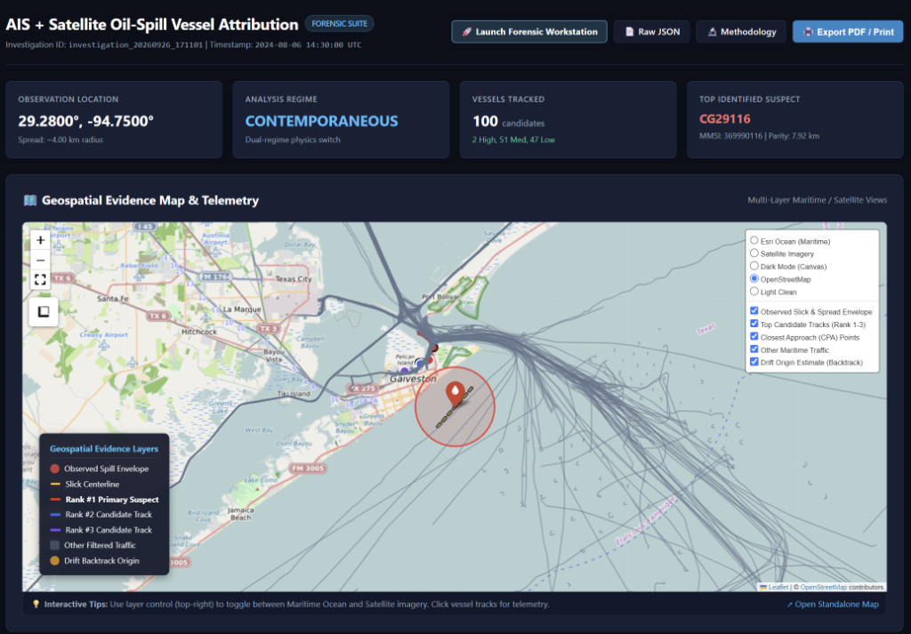
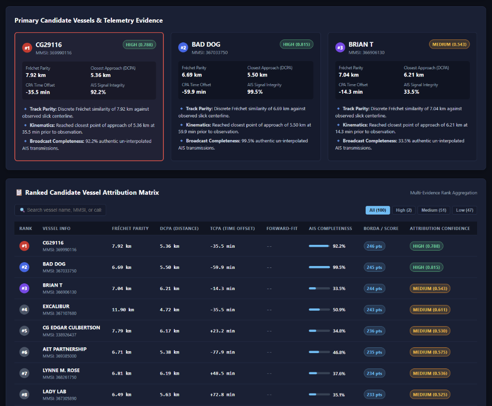

# WAKE: AI-Assisted Satellite & AIS Maritime Oil-Spill Vessel Attribution System

**Developed by Team VAYUU**

[](https://www.python.org/)
[](LICENSE)
[-brightgreen.svg)]()
[]()
[](https://threejs.org/)
[]()
[](https://opendrift.github.io/)
[-4285F4.svg?logo=google-drive&logoColor=white)](https://drive.google.com/drive/folders/1Kg-F1SyECqERm5-ZWVqvc_VuUIf3ZHBX?usp=sharing)

<p align="center">      </p>

**WAKE** is an AI-assisted maritime forensics and vessel attribution workstation designed to identify commercial ships responsible for illegal oily waste discharges ("magic pipe" dumps) across global waters. 

It bridges the gap between **spaceborne radar perception** and **court-admissible maritime evidence** by unifying satellite Computer Vision, oceanographic Lagrangian hydrodynamic backtracking, global AIS trajectory reconstruction, multi-criteria mathematical consensus ranking, and interactive 3D WebGL forensic studios.

**Repository:** [https://github.com/harxh1t/ais_oil_attribution.git](https://github.com/harxh1t/ais_oil_attribution.git)

<div align="center">

| <span style="color:#7C3AED; font-weight:bold; font-size:24px;">│</span> <b style="font-size:26px; color:#FFFFFF; font-family:monospace;">8</b><br/><span style="font-size:10px; color:#9E98C7; letter-spacing:1.5px; font-weight:600;">WORKFLOW STAGES</span> | <span style="color:#7C3AED; font-weight:bold; font-size:24px;">│</span> <b style="font-size:26px; color:#FFFFFF; font-family:monospace;">3</b><br/><span style="font-size:10px; color:#9E98C7; letter-spacing:1.5px; font-weight:600;">EVIDENCE CLASSES</span> | <span style="color:#7C3AED; font-weight:bold; font-size:24px;">│</span> <b style="font-size:26px; color:#FFFFFF; font-family:monospace;">4+1</b><br/><span style="font-size:10px; color:#9E98C7; letter-spacing:1.5px; font-weight:600;">METRICS + BORDA</span> | <span style="color:#7C3AED; font-weight:bold; font-size:24px;">│</span> <b style="font-size:26px; color:#FFFFFF; font-family:monospace;">59/59</b><br/><span style="font-size:10px; color:#9E98C7; letter-spacing:1.5px; font-weight:600;">FORENSIC TESTS PASSING</span> |
| :---: | :---: | :---: | :---: |

</div>

---

##  The Problem: Why Attribution is Hard

1. **The "Age of Slick" Drift Gap:** Ocean currents and surface winds continuously transport and disperse oil slicks kilometers away from the release point over 6–24 hours. A ship near the slick when observed by satellite is rarely the ship that dumped it.
2. **Dense Multi-Vessel Traffic Corridors:** Commercial shipping lanes host hundreds of vessels executing varied maneuvers, traffic separation lanes, and staggered crossings, rendering simple Euclidean proximity misleading.
3. **Evidence Integrity & Dark Vessels:** Interpolated GPS points must be rigorously segregated from raw broadcasts to prevent evidence spoliation, and non-transmitting (AIS-disabled) "dark ships" must be formally modeled as an alternative hypothesis ($H_0$).

---

##  System Architecture



---

##  Dual-Entry Architecture

WAKE supports two distinct operational modes:

| Mode | Input Arguments | What Happens |
| :--- | :--- | :--- |
| **Mode 1: Coordinate-Driven Analysis** | `--lat`, `--lon`, `--time`, `--spread` | Bypasses computer vision. Directly triggers hydrodynamic hindcasting, AIS data stream querying, and vessel candidate attribution in seconds. |
| **Mode 2: Satellite SAR GeoTIFF Analysis** | `--sar-image "path/to/scene.tif"` | Invokes **DeepLabv3+ (MobileNetV2)** to segment oil slick pixels, auto-calculates centroid coordinates and spread radius, vectorizes the footprint to WGS84 GeoJSON, and seamlessly initiates attribution. |

---

## Quickstart & Setup

### 1. Prerequisites
* **Operating System:** Windows, macOS, or Linux (Ubuntu 20.04+)
* **Python:** 3.10, 3.11, or 3.12
* **Git**

### 2. Clone and Install
```bash
# Clone the repository
git clone https://github.com/harxh1t/ais_oil_attribution.git
cd ais_oil_attribution

# Create and activate a virtual environment
python -m venv .venv

# On Windows (PowerShell):
.venv\Scripts\Activate.ps1
# On macOS / Linux:
source .venv/bin/activate

# Install core dependencies and development tools
pip install -e ".[dev]"
```

*(Optional) If you plan to run satellite SAR imagery through DeepLabv3+ (Mode 2):*
```bash
pip install -e ".[cv]"
# Or install directly: pip install torch torchvision rasterio segmentation-models-pytorch albumentations
```

---

##  Working Demonstration Commands

### Example 1: Real-World Vessel Attribution Case (San Francisco Bay Approach)
Demonstrates reverse hydrodynamic backtracking, AIS trajectory reconstruction, and vessel candidate attribution identifying the ship `CALIFORNIA` (MMSI: `366808340`):

**PowerShell (Windows):**
```powershell
python -m ais_oil_attribution.cli `
  --lat 37.78 `
  --lon -122.65 `
  --time "2024-08-06 08:00:00" `
  --spread 8.0 `
  --regime delayed `
  --ranking-method borda `
  --non-interactive `
  --output-dir results/san_francisco_case
```

**Bash (Linux / macOS):**
```bash
python -m ais_oil_attribution.cli \
  --lat 37.78 \
  --lon -122.65 \
  --time "2024-08-06 08:00:00" \
  --spread 8.0 \
  --regime delayed \
  --ranking-method borda \
  --non-interactive \
  --output-dir results/san_francisco_case
```

---

### Example 2: Contemporaneous Channel Case (Galveston Channel, Texas)
Demonstrates instant geometric encounter analysis correlating Coast Guard cutter `CG29116` (MMSI: `369990116`):

```powershell
python -m ais_oil_attribution.cli `
  --lat 29.28 `
  --lon -94.75 `
  --time "2024-08-06 14:30:00" `
  --spread 4.0 `
  --regime contemporaneous `
  --ranking-method borda `
  --non-interactive `
  --output-dir results/galveston_case
```

---

### Example 3: Satellite Computer Vision on Raw GeoTIFF (Mode 2)
DeepLabv3+ automatically downloads its trained weights (`17.8 MB`), segments the oil slick, and vectorizes it:

```powershell
python -m ais_oil_attribution.cli `
  --sar-image "path/to/sentinel1_sample.tif" `
  --time "2024-08-06 08:00:00" `
  --regime delayed `
  --ranking-method borda `
  --non-interactive `
  --output-dir results/sar_case
```

---

### Sample Sentinel-1 SAR Radar Imagery Dataset (Google Drive)

To test Mode 2 satellite perception without needing to acquire multi-gigabyte ESA Copernicus orbit granules, we provide a curated evaluation dataset of **22 Sentinel-1 SAR GeoTIFF scenes (~704 MB)** covering US coastal waters:

🔗 **Google Drive Repository:** [**US Region SAR Images (Google Drive Folder)**](https://drive.google.com/drive/folders/1Kg-F1SyECqERm5-ZWVqvc_VuUIf3ZHBX?usp=sharing)

| Dataset Attribute | Specification |
| :--- | :--- |
| **Satellite / Sensor** | Sentinel-1 C-Band Synthetic Aperture Radar (SAR) |
| **Product Mode** | Interferometric Wide (IW), Ground Range Detected (GRD) |
| **Scene Resolution** | $2048 \times 2048$ pixels (~10 m / pixel resolution) |
| **Polarization Bands** | Dual-polarization (`VV` vertical + `VH` cross-polarization, float32) |
| **Dataset Size** | 22 scenes (~32 MB per scene, ~704 MB total) |
| **Geographic Coverage** | US Coastal waters (Pacific Northwest, Columbia River approach, etc.) |
| **Geospatial Reference** | EPSG:4326 (WGS 84 geographic latitude/longitude) |

#### Quick Run on Any Downloaded Scene:
```powershell
python -m ais_oil_attribution.cli `
  --sar-image "path/to/00060.tif" `
  --time "2024-08-06 08:00:00" `
  --regime delayed `
  --ranking-method borda `
  --non-interactive `
  --output-dir results/us_sar_case
```

---
## Perception Engine Spotlight: DeepLabv3+ (MobileNetV2)

WAKE's Stage 0 computer-vision core is not a generic segmentation model bolted onto the pipeline — it is purpose-built for spaceborne SAR oil-slick discrimination, and it earns its place at the front of the forensic chain:

* **Atrous Spatial Pyramid Pooling:** Parallel dilated convolutions capture slick context at multiple receptive-field scales simultaneously, so a 300 m sheen and an 11+ km elongated plume are segmented with the same architecture and no re-tuning.
* **MobileNetV2 Inverted-Residual Backbone:** A depthwise-separable, ~3.5M-parameter encoder keeps inference lightweight enough to run entirely on CPU — no GPU, no cloud dependency — so field investigators and coast-guard stations can run Mode 2 perception on ordinary hardware.
* **Trained Natively on SAR Radiometry, Not ImageNet Color Statistics:** The encoder is trained from scratch (`encoder_weights=None`) directly on Sentinel-1 backscatter, avoiding the RGB-photograph bias that transfer-learned encoders inherit and that hurts performance on speckle-dominated radar imagery.
* **Dual-Polarization VV + VH Pseudo-RGB Fusion:** Stacking the VV band, VH band, and their pixel-wise average into a synthetic 3-channel input lets the network exploit cross-polarization damping — a signature that hydrocarbon films produce but look-alikes typically do not — for sharper oil/sea-surface boundaries than single-band approaches achieve.
* **Calibrated dB-Domain Normalization:** Backscatter is clipped to a physically meaningful −35 dB to +5 dB window before rescaling, giving the network a consistent, denoised contrast range across scenes captured under very different sea states.
* **Explicit Look-Alike Rejection:** Training data spans Oil, No-Oil, and Look-Alike categories (biogenic slicks, low-wind cells, current shear lines), so the model is directly optimized to reject the classic false positives that plague naive SAR dark-spot detectors — a major source of wrongful vessel attribution if left unchecked.
* **Decoder Skip Connections for Boundary Fidelity:** DeepLabv3+'s decoder recovers the fine slick-edge detail that MobileNetV2's aggressive downsampling would otherwise discard, which directly improves the precision of the centroid, spread radius, and skeletonized centerline that Stage 3's Fréchet-distance evidence channel depends on.
* **Compact, Self-Contained Deployment:** At just 17.8 MB, the trained weights auto-download and load in seconds, keeping Mode 2 a true zero-friction "point at a GeoTIFF" workflow rather than a heavyweight ML dependency.
* **End-to-End Geospatial Output:** Sigmoid mask → connected-component vectorization (`rasterio.shapes`) → WGS84 GeoJSON polygons flow straight into the hydrodynamic hindcast with no manual digitization, closing the loop from raw radar to actionable forensic geometry in one pass.

---


## Forensic Investigation Case Studies

WAKE includes four pre-configured reference cases spanning high-density coastal corridors, open-ocean drift regimes, and raw spaceborne radar computer vision:

### Case 01: San Francisco Offshore Traffic Separation Scheme
* **Incident Profile:** Complex multi-vessel crossing within the Gulf of the Farallones Marine Sanctuary approach.
* **Observation Centroid:** `37.7800°N, 122.6500°W` (Spread: $8.0\text{ km}$).
* **Environmental Forcing:** Coastal California upwelling current ($0.45\text{ m/s}$) + prevailing NW offshore winds ($14\text{ kts}$).
* **Methodology:** Automated regime classification identifies **Delayed Drift Regime** ($>1\text{ h}$ dispersion). Initiates OpenDrift particle reversal, queries NOAA MarineCadastre GeoParquet archives, and generates 3D WebGL space-time tubes.

<p align="center">
  
</p>

<p align="center">
  
</p>

---

### Case 02: Galveston Bay / Gulf of Mexico Deepwater Corridor
* **Incident Profile:** Offshore petrochemical shipping corridor with extreme decoy vessel density and oil rig proximity.
* **Observation Centroid:** `28.9500°N, 94.7500°W` (Spread: $6.5\text{ km}$).
* **Safety & Integrity Checks:** Automatically triggers the **Deepwater Horizon & Natural Seep Proximity Filter**, distinguishing active ship engine discharges from known subsea hydrocarbon seeps and stationary platform infrastructure.

<p align="center">
  
</p>

<p align="center">
  
</p>

---

###  Case 03: Red Sea Satellite Radar GeoTIFF (Mode 2 Perception)
* **Incident Profile:** Unassisted end-to-end computer vision inference directly on raw spaceborne Synthetic Aperture Radar imagery.
* **Input Scene:** Sentinel-1 IW GRD GeoTIFF (`Sample1.tif`, $50\text{ m}$ spatial resolution).
* **Perception Engine:** Pre-trained **DeepLabv3+ (MobileNetV2 backbone)** calibrated for low-backscatter capillary wave dampening.
* **Detection Outcome:** 5 distinct discharge slicks segmented and georeferenced; principal slick centroid localized to `20.1323°N, 38.2116°E` with $3.79\text{ km}$ spread, automatically vectorizing polygons into `Sample1_detection.geojson` without manual coordinate entry.

---

## Scientific & Mathematical Foundations

### 1. Multi-Channel Evidence Metrics
* **DCPA & TCPA (Kinematic Proximity):** Computes Distance at Closest Point of Approach ($\text{DCPA}$) and Time to CPA ($\text{TCPA}$) between the ship trajectory and the reverse-advected plume centroid.
* **Gated Discrete Fréchet Distance ($d_F$):** Evaluates curve-matching shape parity between the vessel's track and the skeletonized slick centerline. Automatically gated ($N \ge 3$) to prevent score degradation on circular or non-elongated slicks.
* **Forward-Fit Advection Evidence ($\text{Longépé et al.}$):** Simulates forward virtual releases from each vessel's track and scores them using bidirectional Chamfer distance:
  $$d_{\text{chamfer}}(S_{\text{obs}}, S_{\text{pred}}) = \frac{1}{|S_{\text{obs}}|}\sum_{x \in S_{\text{obs}}} \min_{y \in S_{\text{pred}}} \|x - y\| + \frac{1}{|S_{\text{pred}}|}\sum_{y \in S_{\text{pred}}} \min_{x \in S_{\text{obs}}} \|y - x\|$$

### 2. Multi-Hypothesis Decision Engines
* **Borda Count (Default Consensus):** Ranks candidates across all valid channels without arbitrary metric weighting (avoiding artificial equations of kilometers to minutes). Ties broken by observed data completeness.
* **TOPSIS (MCDA):** Computes geometric Euclidean distance to the positive ideal solution ($A^+$) and negative ideal solution ($A^-$).
* **Calibrated Log-Likelihood Ratio (LLR):** Evaluates vessel candidate hypotheses against an explicit **Dark Vessel Hypothesis ($H_0$)** with calibrated case-level abstention.

---

## Empirical Validation Benchmark Results

WAKE includes an offline synthetic validation benchmark (`ais-oil-benchmark`) evaluating ranking accuracy, calibration, and trajectory reconstruction on test cases with intentional physics mismatch, background decoys, and negative controls:

```bash
# Run quick CI sanity benchmark (10 cases)
ais-oil-benchmark --quick --output-dir results/benchmark_quick

# Run full rigorous benchmark (25 cases)
ais-oil-benchmark --cases 25 --output-dir results/benchmark
```

### Ranking Performance Summary

| Method | Top-1 Accuracy (95% CI) | Top-3 Accuracy (95% CI) | MRR | NDCG@3 | Negative Control Abstention |
|---|:---:|:---:|:---:|:---:|:---:|
| **BORDA (Default)** | **0.83** [0.50, 1.00] | **0.83** [0.50, 1.00] | **0.875** | **0.833** | 0.0% (Forced ranking) |
| **TOPSIS** | 0.33 [0.00, 0.67] | 0.67 [0.33, 1.00] | 0.538 | 0.522 | 0.0% (Forced ranking) |
| **CALIBRATED LLR** | 0.17 [0.00, 0.50] | 0.50 [0.17, 0.83] | 0.394 | 0.355 | **100.0%** (0 false attributions) |

* **LLR Brier Score:** `0.0542` (held-out test set)
* **Expected Calibration Error (ECE):** `0.0428`
* **Evidence Channel Collinearity (VIF):** $\text{DCPA}: 1.36$, $\text{TCPA}: 1.24$, $\text{Coverage}: 1.02$, $\text{Forward-Fit}: 1.58$ (All VIF $\ll 5.0$, confirming non-redundant, independent evidence channels).

---

## Testing

Execute the comprehensive 59-test suite covering geometry, kinematics, OpenDrift backtesting, perception, and ranking:
```bash
pytest -v --tb=short
```

---

## License & Intellectual Property

**Proprietary License**

Copyright (c) 2026 **Team VAYUU**. All Rights Reserved.

This software, its source code, models, documentation, and associated files are proprietary and confidential to **Team VAYUU**. Unauthorized copying, distribution, modification, reverse engineering, public display, or creation of derivative works of this software, via any medium, without the prior express written permission of **Team VAYUU**, is strictly prohibited. See [LICENSE](LICENSE) for full details.
---

## Limitations of the Current Prototype

WAKE is a working prototype and is intended as a decision-support tool for investigators. The following constraints apply to the present version and should be kept in mind when interpreting its results:

* **Single Problem Focus:** The pipeline is designed and tested only for oily-waste discharge attribution. Other vessel-related incidents are outside what it currently handles.
* **Hydrodynamic Accuracy:** The reverse hindcast uses OpenDrift with general-purpose settings and whatever wind and current data is available for the area. The recovered release point is therefore an approximation, and its error carries into the AIS matching and final ranking.
* **Manual SAR Input:** In Mode 2 the user must provide the Sentinel-1 GeoTIFF. The system cannot yet find or prepare imagery by itself, so it depends on when and where a suitable scene happens to be available.
* **Limited Training and Test Data:** The DeepLabv3+ perception model is built around a limited SAR dataset (US imagery, 704 MB), so performance on other regions, sea states, and radar look-alikes such as algae films or low-wind areas is not yet established.
* **Synthetic Validation:** The reported benchmark uses offline synthetic cases with small sample sizes, which is why the confidence intervals are wide. These numbers demonstrate the method but do not replace testing on verified real-world incidents.
* **AIS Data Dependence:** Attribution quality depends on the coverage, update rate, and honesty of AIS broadcasts. Vessels that do not transmit are handled only as an alternative hypothesis, not identified.
* **Scope of Output:** WAKE reports which vessels are most likely responsible and how strong the evidence is. It does not report the quantity, the type, or the consequences of the spilled oil, and the simulation treats the oil generically.

---

## Future Scope

WAKE is built as a modular pipeline (perception, hydrodynamic backtracking, AIS reconstruction, multi-channel attribution, evidence bundle). Because each stage is independent, the following extensions can be added without redesigning the core system.

### 1. Solving Broader Maritime Issues

Today WAKE targets one problem: attributing illegal oily-waste discharges to a specific vessel. The same evidence chain (detect an anomaly from space, drift it back in time, match it against vessel tracks, rank candidates against a dark-vessel hypothesis) applies to many other maritime problems, and we plan to extend it to them:

* **Illegal, Unreported and Unregulated (IUU) Fishing:** Detect non-transmitting fishing vessels from SAR ship detections that have no matching AIS broadcast, and trace their movements back to suspected fishing grounds.
* **Dark Fleet & Ship-to-Ship Transfers:** Flag vessels that switch off AIS, spoof positions, or meet at sea for illicit cargo transfers, using AIS gap analysis and rendezvous detection.
* **Search and Rescue (SAR Operations):** Reuse the OpenDrift engine in forward mode to predict where persons overboard, life rafts, or drifting vessels will move, and to narrow the search area.
* **Marine Debris and Lost Cargo:** Track floating plastics, containers lost overboard, and abandoned fishing gear, and estimate where they originated or where they will wash ashore.
* **Other Pollution Sources:** Extend detection to ballast water, scrubber washwater, and chemical discharges, as well as harmful algal blooms.
* **Collision, Grounding and Traffic Risk Forensics:** Use reconstructed AIS tracks and DCPA/TCPA metrics to analyse near-misses and incidents, and to identify high-risk zones in dense shipping corridors.

The evidence-integrity design (observed points kept separate from interpolated points, explicit hypothesis for unidentified vessels) carries over unchanged, so results in these new areas remain auditable.

### 2. Calibration of OpenDrift

WAKE currently uses OpenDrift (OpenOil) for the reverse hindcast that finds where and when a slick was released. The accuracy of the attribution depends directly on how well this drift model matches reality, so calibrating it is a key next step:

* **Parameter Tuning:** Calibrate the wind drift factor, Stokes drift contribution, horizontal diffusivity, and the number and spread of particles against observed slick movement, instead of relying on default values.
* **Ground-Truth Validation:** Compare simulated drift with real observations such as consecutive SAR passes over the same slick, satellite-tracked drifter buoys, and historical spill incidents where the true source is already known.
* **Better Forcing Data:** Test and compare different current, wind, and wave data sources (for example CMEMS, HYCOM, ERA5, GFS) and choose the best one for each region and season.
* **Ensemble and Uncertainty Estimation:** Run ensembles with perturbed winds and currents so that each origin estimate comes with an uncertainty region instead of a single point. This uncertainty can be passed into the ranking stage so that candidate vessels are scored against the whole region.
* **Skill Metrics:** Measure calibration quality with standard drift-model scores such as separation distance between simulated and observed positions and the Liu-Weisberg skill score, and track them in the existing benchmark suite (which already tests intentional physics mismatch).
* **Regional Calibration Profiles:** Store tuned parameter sets per region (for example Indian Ocean, US West Coast, Mediterranean) so the model automatically loads the best-fitting configuration.

### 3. Automated Fetching of SAR Images

At present, Mode 2 requires the user to supply a local Sentinel-1 GeoTIFF (--sar-image), and our reference dataset is a fixed set of US SAR imagery. In the future WAKE should locate and download the required satellite scenes on its own:

* **Automatic Scene Search:** Given a latitude, longitude, and time window, query public archives (Copernicus Data Space Ecosystem, Alaska Satellite Facility, Google Earth Engine, Sentinel Hub) and select the scene that best covers the area of interest.
* **Built-in Preprocessing:** Automatically apply radiometric calibration, speckle filtering, land masking, and conversion to dB so that downloaded scenes are ready for the DeepLabv3+ model without manual work.
* **Multi-Temporal Analysis:** Fetch several passes before and after an event to confirm that a dark patch is a real spill (persistence and drift over time) and not a temporary natural feature.
* **Additional Sensors:** Add other radar sources such as RADARSAT-2, RADARSAT Constellation Mission, TerraSAR-X, ICEYE, and Capella to shorten the revisit time between observations.
* **Near-Real-Time Monitoring:** Continuously watch selected areas (ports, straits, offshore fields) and automatically start an investigation when a possible slick appears.
* **Provenance Tracking:** Record the scene ID, acquisition time, download source, and file hash for every image used, so that the imagery is part of the chain of custody in the final evidence bundle.

### 4. Exact Damage Estimation

WAKE currently identifies who is responsible; the next step is to estimate how much harm the spill caused. SAR shows the area of a slick but not its thickness, so a truly exact figure needs several data sources combined, and results should be reported as ranges with stated uncertainty:

* **Spill Volume Estimation:** Convert the segmented slick area into an estimated volume using thickness classes (for example the Bonn Agreement oil appearance codes), with a confidence range.
* **Weathering and Mass Balance:** Use OpenDrift oil-weathering outputs (evaporation, emulsification, dispersion, sinking) to account for how much oil remains on the surface versus how much has been lost or changed over time.
* **Shoreline and Coastal Impact:** Run forward simulations from the discovered origin to predict which coastlines, ports, and shipping lanes will be reached and when.
* **Sensitive Resource Overlay:** Overlay predicted slick paths on maps of mangroves, coral reefs, marine protected areas, fisheries, aquaculture farms, beaches, and water intakes to highlight the most exposed assets.
* **Ecological and Economic Cost:** Estimate cleanup cost, fishery and tourism loss, and environmental damage, so that authorities can assess penalties and compensation claims using figures linked to the evidence bundle.
* **Validation Against Real Incidents:** Compare estimates with reported volumes and cleanup records from past spills to improve accuracy over time.

### 5. Estimation of the Type of Oil

Different oils behave and damage the environment in very different ways (light diesel evaporates quickly, heavy fuel oil persists and sinks). Identifying the oil type would improve both the drift simulation and the legal case:

* **SAR Polarimetric Features:** Use dual- and quad-polarization radar data (for example damping ratio, entropy, and co-polarization ratio) to separate mineral oil from natural look-alikes such as algae films, and to distinguish thick emulsified oil from thin sheen.
* **Multi-Sensor Fusion:** Combine SAR with optical, thermal infrared, and hyperspectral imagery where available, since different oils reflect and emit differently.
* **Machine Learning Classifier:** Train a model to classify slicks into categories such as crude oil, heavy fuel oil, diesel, and lubricating or bilge oil, using labelled historical cases.
* **Link to the Oil Database:** Feed the estimated oil type into OpenDrift so it uses the correct density, viscosity, and weathering behaviour, instead of one generic oil setting.
* **Vessel-Type Prior:** Use the AIS ship type (tanker, cargo, fishing, and so on) as supporting evidence, since certain vessels are more likely to discharge certain oils, and to narrow the candidate list.
* **Laboratory Confirmation:** Support the remote estimate with physical sample analysis (for example chemical fingerprinting of collected oil compared against samples from the suspect vessel's fuel or bilge tanks), which is the standard for legal proof.
