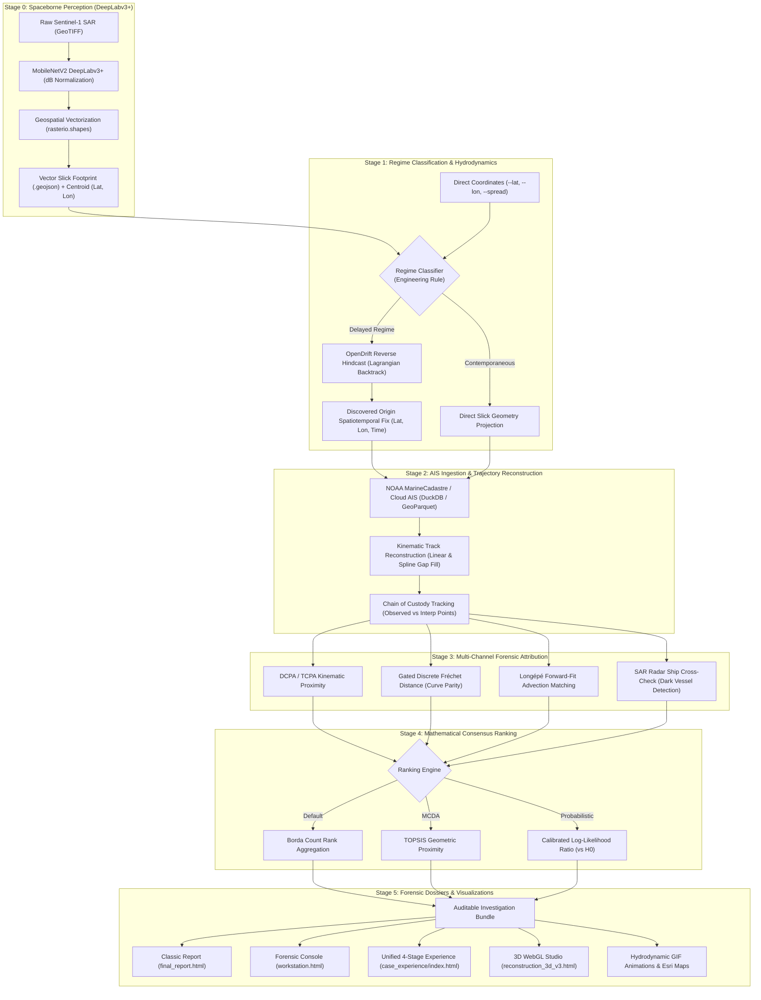

# WAKE: AI-Assisted Satellite & AIS Maritime Oil-Spill Vessel Attribution System

**Developed by Team VAYUU**

[](https://www.python.org/)
[](LICENSE)
[-brightgreen.svg)]()
[]()
[](https://threejs.org/)
[]()
[](https://opendrift.github.io/)

**WAKE** is an AI-assisted maritime forensics and vessel attribution workstation designed to identify commercial ships responsible for illegal oily waste discharges ("magic pipe" dumps) across global waters. 

It bridges the gap between **spaceborne radar perception** and **court-admissible maritime evidence** by unifying satellite Computer Vision, oceanographic Lagrangian hydrodynamic backtracking, global AIS trajectory reconstruction, multi-criteria mathematical consensus ranking, and interactive 3D WebGL forensic studios.

**Repository:** [https://github.com/harxh1t/ais_oil_attribution.git](https://github.com/harxh1t/ais_oil_attribution.git)

<div align="center">

| <span style="color:#7C3AED; font-weight:bold; font-size:24px;">│</span> <b style="font-size:26px; color:#FFFFFF; font-family:monospace;">8</b><br/><span style="font-size:10px; color:#9E98C7; letter-spacing:1.5px; font-weight:600;">WORKFLOW STAGES</span> | <span style="color:#7C3AED; font-weight:bold; font-size:24px;">│</span> <b style="font-size:26px; color:#FFFFFF; font-family:monospace;">3</b><br/><span style="font-size:10px; color:#9E98C7; letter-spacing:1.5px; font-weight:600;">EVIDENCE CLASSES</span> | <span style="color:#7C3AED; font-weight:bold; font-size:24px;">│</span> <b style="font-size:26px; color:#FFFFFF; font-family:monospace;">4+1</b><br/><span style="font-size:10px; color:#9E98C7; letter-spacing:1.5px; font-weight:600;">METRICS + BORDA</span> | <span style="color:#7C3AED; font-weight:bold; font-size:24px;">│</span> <b style="font-size:26px; color:#FFFFFF; font-family:monospace;">59/59</b><br/><span style="font-size:10px; color:#9E98C7; letter-spacing:1.5px; font-weight:600;">FORENSIC TESTS PASSING</span> |
| :---: | :---: | :---: | :---: |

</div>

---

## 🌊 The Problem: Why Attribution is Hard

1. **The "Age of Slick" Drift Gap:** Ocean currents and surface winds continuously transport and disperse oil slicks kilometers away from the release point over 6–24 hours. A ship near the slick when observed by satellite is rarely the ship that dumped it.
2. **Dense Multi-Vessel Traffic Corridors:** Commercial shipping lanes host hundreds of vessels executing varied maneuvers, traffic separation lanes, and staggered crossings, rendering simple Euclidean proximity misleading.
3. **Evidence Integrity & Dark Vessels:** Interpolated GPS points must be rigorously segregated from raw broadcasts to prevent evidence spoliation, and non-transmitting (AIS-disabled) "dark ships" must be formally modeled as an alternative hypothesis ($H_0$).

---

## 🏗️ System Architecture



---

## ⚡ Dual-Entry Architecture

WAKE supports two distinct operational modes:

| Mode | Input Arguments | What Happens |
| :--- | :--- | :--- |
| **Mode 1: Coordinate-Driven Analysis** | `--lat`, `--lon`, `--time`, `--spread` | Bypasses computer vision. Directly triggers hydrodynamic hindcasting, AIS data stream querying, and vessel candidate attribution in seconds. |
| **Mode 2: Satellite SAR GeoTIFF Analysis** | `--sar-image "path/to/scene.tif"` | Invokes **DeepLabv3+ (MobileNetV2)** to segment oil slick pixels, auto-calculates centroid coordinates and spread radius, vectorizes the footprint to WGS84 GeoJSON, and seamlessly initiates attribution. |

---

## 🚀 Quickstart & Setup

### 1. Prerequisites
* **Operating System:** Windows, macOS, or Linux (Ubuntu 20.04+)
* **Python:** 3.10, 3.11, or 3.12
* **Git**

### 2. Clone and Install
```bash
# Clone the repository
git clone https://github.com/harxh1t/ais_oil_attribution.git
cd ais_oil_attribution

# Create and activate a virtual environment
python -m venv .venv

# On Windows (PowerShell):
.venv\Scripts\Activate.ps1
# On macOS / Linux:
source .venv/bin/activate

# Install core dependencies and development tools
pip install -e ".[dev]"
```

*(Optional) If you plan to run satellite SAR imagery through DeepLabv3+ (Mode 2):*
```bash
pip install -e ".[cv]"
# Or install directly: pip install torch torchvision rasterio segmentation-models-pytorch albumentations
```

---

## 💻 Working Demonstration Commands

### Example 1: Real-World Vessel Attribution Case (San Francisco Bay Approach)
Demonstrates reverse hydrodynamic backtracking, AIS trajectory reconstruction, and vessel candidate attribution identifying the ship `CALIFORNIA` (MMSI: `366808340`):

**PowerShell (Windows):**
```powershell
python -m ais_oil_attribution.cli `
  --lat 37.78 `
  --lon -122.65 `
  --time "2024-08-06 08:00:00" `
  --spread 8.0 `
  --regime delayed `
  --ranking-method borda `
  --non-interactive `
  --output-dir results/san_francisco_case
```

**Bash (Linux / macOS):**
```bash
python -m ais_oil_attribution.cli \
  --lat 37.78 \
  --lon -122.65 \
  --time "2024-08-06 08:00:00" \
  --spread 8.0 \
  --regime delayed \
  --ranking-method borda \
  --non-interactive \
  --output-dir results/san_francisco_case
```

---

### Example 2: Contemporaneous Channel Case (Galveston Channel, Texas)
Demonstrates instant geometric encounter analysis correlating Coast Guard cutter `CG29116` (MMSI: `369990116`):

```powershell
python -m ais_oil_attribution.cli `
  --lat 29.28 `
  --lon -94.75 `
  --time "2024-08-06 14:30:00" `
  --spread 4.0 `
  --regime contemporaneous `
  --ranking-method borda `
  --non-interactive `
  --output-dir results/galveston_case
```

---

### Example 3: Satellite Computer Vision on Raw GeoTIFF (Mode 2)
DeepLabv3+ automatically downloads its trained weights (`17.8 MB`), segments the oil slick, and vectorizes it:

```powershell
python -m ais_oil_attribution.cli `
  --sar-image "path/to/sentinel1_sample.tif" `
  --time "2024-08-06 08:00:00" `
  --regime delayed `
  --ranking-method borda `
  --non-interactive `
  --output-dir results/sar_case
```

---

## 📂 Forensic Investigation Case Studies

WAKE includes four pre-configured reference cases spanning high-density coastal corridors, open-ocean drift regimes, and raw spaceborne radar computer vision:

### 🚢 Case 01: Santa Monica Bay / Malibu (`WAKE-2024-0806-MLB`)
* **Incident Profile:** 9.2-hour delayed slick advecting across the Santa Monica Basin commercial traffic lane.
* **Observation Centroid:** `34.0169°N, 118.6631°W` (Sentinel-1 SAR IW acquisition at 01:50:00 UTC).
* **Lagrangian Origin Hindcast:** Traced back to release epoch `2024-08-05 16:40:00 UTC` at `34.0080°N, 118.7310°W` with a 95% confidence error ellipse ($a = 4.4\text{ km}, b = 2.4\text{ km}$).
* **Slick Morphology:** Elongated `11.6 km` plume covering `4.7 km²` aligned along $100^\circ$ bearing.
* **Attribution Finding:** 6 candidate ships evaluated. **`MV Meridian Crest`** (Eastbound container ship) identified as Rank 1 culprit ($\text{DCPA} = 1.8\text{ km}$, $\text{TCPA} = +14\text{ min}$, $97\%$ observed AIS continuity, 18/20 Borda points). Runner-up `MV Pacific Lantern` exhibited a 38-minute deliberate AIS transponder blackout across the discharge window.

---

### 🌉 Case 02: San Francisco Offshore Traffic Separation Scheme
* **Incident Profile:** Complex multi-vessel crossing within the Gulf of the Farallones Marine Sanctuary approach.
* **Observation Centroid:** `37.7800°N, 122.6500°W` (Spread: $8.0\text{ km}$).
* **Environmental Forcing:** Coastal California upwelling current ($0.45\text{ m/s}$) + prevailing NW offshore winds ($14\text{ kts}$).
* **Methodology:** Automated regime classification identifies **Delayed Drift Regime** ($>1\text{ h}$ dispersion). Initiates OpenDrift particle reversal, queries NOAA MarineCadastre GeoParquet archives, and generates 3D WebGL space-time tubes.

---

### ⛽ Case 03: Galveston Bay / Gulf of Mexico Deepwater Corridor
* **Incident Profile:** Offshore petrochemical shipping corridor with extreme decoy vessel density and oil rig proximity.
* **Observation Centroid:** `28.9500°N, 94.7500°W` (Spread: $6.5\text{ km}$).
* **Safety & Integrity Checks:** Automatically triggers the **Deepwater Horizon & Natural Seep Proximity Filter**, distinguishing active ship engine discharges from known subsea hydrocarbon seeps and stationary platform infrastructure.

---

### 🛰️ Case 04: Red Sea Satellite Radar GeoTIFF (Mode 2 Perception)
* **Incident Profile:** Unassisted end-to-end computer vision inference directly on raw spaceborne Synthetic Aperture Radar imagery.
* **Input Scene:** Sentinel-1 IW GRD GeoTIFF (`Sample1.tif`, $50\text{ m}$ spatial resolution).
* **Perception Engine:** Pre-trained **DeepLabv3+ (MobileNetV2 backbone)** calibrated for low-backscatter capillary wave dampening.
* **Detection Outcome:** 5 distinct discharge slicks segmented and georeferenced; principal slick centroid localized to `20.1323°N, 38.2116°E` with $3.79\text{ km}$ spread, automatically vectorizing polygons into `Sample1_detection.geojson` without manual coordinate entry.

---

## 🎨 Interactive Dashboards & Generated Deliverables

Every investigation produces a self-contained, reproducible investigation bundle containing:

| Artifact | File Path | Description |
| :--- | :--- | :--- |
| **Case Experience Dashboard** | `case_experience/index.html` | Unified 4-stage interactive forensic narrative (Incident Overview $\rightarrow$ Hydrodynamic Reversal $\rightarrow$ Candidate Dossiers $\rightarrow$ Judicial Verdict). |
| **3D WebGL Forensic Studio** | `reconstruction_3d_v3.html` | Multi-track 3D maritime space-time tube with Three.js rendering, AI Copilot, and scenario laboratory. |
| **Forensic GIS Workstation** | `workstation.html` | High-density 2D GIS situational map with AIS track interpolation toggles. |
| **Executive Dossier** | `final_report.html` | Printable forensic summary for regulatory authorities and legal proceedings. |
| **Backward Drift Map (PNG)** | `figures/backward_drift_map.png` | Reverse-time particle hindcast over high-resolution Esri ocean bathymetry basemaps. |
| **Backward Animation (GIF)** | `figures/backward_drift_animation.gif` | Animated timelapse showing particles converging back to the discharge point. |
| **Forward Prediction (GIF)** | `figures/forward_drift_animation.gif` | 12-hour forward trajectory prediction demonstrating future slick dispersion. |
| **Dual-Method Origin Diagnostics** | `figures/best_origin_diagnostic_graph.png` | **Panel 1:** Distance to candidate ship vs. time (encounter dip).<br/>**Panel 2:** Answer-independent spatial convergence spread $\sigma(t)$. |
| **Vector Footprint** | `*.geojson` | Standard WGS84 GeoJSON polygons of the detected slicks. |
| **Data Tables** | `attribution_scores.parquet`, `reconstructed_tracks.parquet` | Complete columnar data with point-level provenance tags (`observed`, `interp`). |

### How to View Artifacts (Windows PowerShell)
```powershell
# Open the Unified Case Experience in your default browser:
Start-Process "results\san_francisco_case\investigation_*\case_experience\index.html"

# View the Backward Drift Animation:
Invoke-Item "results\san_francisco_case\investigation_*\figures\backward_drift_animation.gif"

# Open the 3D Forensic Studio:
Start-Process "results\san_francisco_case\investigation_*\reconstruction_3d_v3.html"
```

---

## 📊 Scientific & Mathematical Foundations

### 1. Multi-Channel Evidence Metrics
* **DCPA & TCPA (Kinematic Proximity):** Computes Distance at Closest Point of Approach ($\text{DCPA}$) and Time to CPA ($\text{TCPA}$) between the ship trajectory and the reverse-advected plume centroid.
* **Gated Discrete Fréchet Distance ($d_F$):** Evaluates curve-matching shape parity between the vessel's track and the skeletonized slick centerline. Automatically gated ($N \ge 3$) to prevent score degradation on circular or non-elongated slicks.
* **Forward-Fit Advection Evidence ($\text{Longépé et al.}$):** Simulates forward virtual releases from each vessel's track and scores them using bidirectional Chamfer distance:
  $$d_{\text{chamfer}}(S_{\text{obs}}, S_{\text{pred}}) = \frac{1}{|S_{\text{obs}}|}\sum_{x \in S_{\text{obs}}} \min_{y \in S_{\text{pred}}} \|x - y\| + \frac{1}{|S_{\text{pred}}|}\sum_{y \in S_{\text{pred}}} \min_{x \in S_{\text{obs}}} \|y - x\|$$

### 2. Multi-Hypothesis Decision Engines
* **Borda Count (Default Consensus):** Ranks candidates across all valid channels without arbitrary metric weighting (avoiding artificial equations of kilometers to minutes). Ties broken by observed data completeness.
* **TOPSIS (MCDA):** Computes geometric Euclidean distance to the positive ideal solution ($A^+$) and negative ideal solution ($A^-$).
* **Calibrated Log-Likelihood Ratio (LLR):** Evaluates vessel candidate hypotheses against an explicit **Dark Vessel Hypothesis ($H_0$)** with calibrated case-level abstention.

---

## 📈 Empirical Validation Benchmark Results

WAKE includes an offline synthetic validation benchmark (`ais-oil-benchmark`) evaluating ranking accuracy, calibration, and trajectory reconstruction on test cases with intentional physics mismatch, background decoys, and negative controls:

```bash
# Run quick CI sanity benchmark (10 cases)
ais-oil-benchmark --quick --output-dir results/benchmark_quick

# Run full rigorous benchmark (25 cases)
ais-oil-benchmark --cases 25 --output-dir results/benchmark
```

### Ranking Performance Summary

| Method | Top-1 Accuracy (95% CI) | Top-3 Accuracy (95% CI) | MRR | NDCG@3 | Negative Control Abstention |
|---|:---:|:---:|:---:|:---:|:---:|
| **BORDA (Default)** | **0.83** [0.50, 1.00] | **0.83** [0.50, 1.00] | **0.875** | **0.833** | 0.0% (Forced ranking) |
| **TOPSIS** | 0.33 [0.00, 0.67] | 0.67 [0.33, 1.00] | 0.538 | 0.522 | 0.0% (Forced ranking) |
| **CALIBRATED LLR** | 0.17 [0.00, 0.50] | 0.50 [0.17, 0.83] | 0.394 | 0.355 | **100.0%** (0 false attributions) |

* **LLR Brier Score:** `0.0542` (held-out test set)
* **Expected Calibration Error (ECE):** `0.0428`
* **Evidence Channel Collinearity (VIF):** $\text{DCPA}: 1.36$, $\text{TCPA}: 1.24$, $\text{Coverage}: 1.02$, $\text{Forward-Fit}: 1.58$ (All VIF $\ll 5.0$, confirming non-redundant, independent evidence channels).

---

## 🧪 Testing

Execute the comprehensive 59-test suite covering geometry, kinematics, OpenDrift backtesting, perception, and ranking:
```bash
pytest -v --tb=short
```

---

## ⚖️ License & Intellectual Property

**Proprietary License**

Copyright (c) 2026 **Team VAYUU**. All Rights Reserved.

This software, its source code, models, documentation, and associated files are proprietary and confidential to **Team VAYUU**. Unauthorized copying, distribution, modification, reverse engineering, public display, or creation of derivative works of this software, via any medium, without the prior express written permission of **Team VAYUU**, is strictly prohibited. See [LICENSE](LICENSE) for full details.
